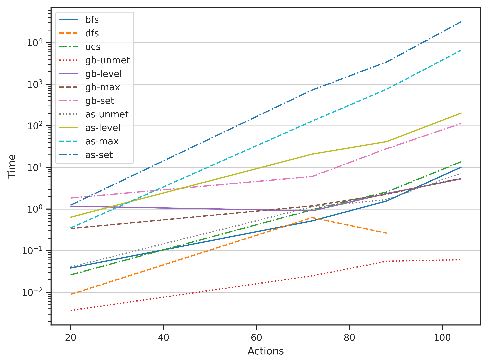

<!-- date: Oct. 10, 2023 ..>

<!-- # Project Report: Air Cargo Planning Agent -->

In this project, we implement and study a forward planning agent to solve four
air cargo planning problems, each with increasing complexity. We explore various
uninformed search algorithms, as well as informed search algorithms in
combination with various heuristics.

# Problem Labels

The following table provides some useful labels that will be used to identify
the various air cargo planning problems explored in this report:

| Label | Problem Description |
| -------- | -------- |
| p1 | Air Cargo Problem 1 |
| p2 | Air Cargo Problem 2 |
| p3 | Air Cargo Problem 3 |
| p4 | Air Cargo Problem 4 |

# Algorithm Labels

The following table provides some useful labels that will be used to identify
the various algorithms explored in this report:

| Label | Search Algorithm | Heuristic |
| -------- | -------- | -------- |
| bfs | Breadth-First Search | n/a |
| dfs | Depth-First Search | n/a |
| ucs | Uniform Cost Search | n/a |
| gb-unmet | Greedy Best First Search | Unmet Goals |
| gb-level | Greedy Best First Search | Level Sum |
| gb-max | Greedy Best First Search | Max Level |
| gb-set | Greedy Best First Search | Set Level |
| as-unmet | A* Search | Unmet Goals |
| as-level | A* Search | Level Sum |
| as-max | A* Search | Max Level |
| as-set | A* Search | Set Level |

# Results

In this section, the data collected from exploring the various problems and
algorithms are presented in table format. Based on findings from `p1` and `p2`,
the `dfs` algorithm was not executed for `p4`, primarily due to its inability to
find the optimal path. I would have also omitted the `as-max` and `as-set`
algorithms based on their computational expense, but I decided to run them
anyway, just for fun!

\newpage
| Problem | Label | Actions | Expansions | Goal Tests | New Nodes | Plan Length | Time |
| :---: | --- | :---: | :---: | :---: | :---: | :---: | :---: |
| p1 | bfs | 20 | 43 | 56 | 178 | 6 | 3.83E-02 |
| p1 | dfs | 20 | 21 | 22 | 84 | 20 | 8.90E-03 |
| p1 | ucs | 20 | 60 | 62 | 240 | 6 | 2.62E-02 |
| p1 | gb-unmet | 20 | 7 | 9 | 29 | 6 | 3.65E-03 |
| p1 | gb-level | 20 | 6 | 8 | 28 | 6 | 1.17E+00 |
| p1 | gb-max | 20 | 6 | 8 | 24 | 6 | 3.40E-01 |
| p1 | gb-set | 20 | 7 | 9 | 31 | 7 | 1.84E+00 |
| p1 | as-unmet | 20 | 50 | 52 | 206 | 6 | 4.05E-02 |
| p1 | as-level | 20 | 28 | 30 | 122 | 6 | 6.36E-01 |
| p1 | as-max | 20 | 43 | 45 | 180 | 6 | 3.51E-01 |
| p1 | as-set | 20 | 51 | 53 | 208 | 6 | 1.24E+00 |

| Problem | Label | Actions | Expansions | Goal Tests | New Nodes | Plan Length | Time |
| :---: | --- | :---: | :---: | :---: | :---: | :---: | :---: |
| p2 | bfs | 72 | 3343 | 4609 | 30503 | 9 | 5.20E-01 |
| p2 | dfs | 72 | 624 | 625 | 5602 | 619 | 6.22E-01 |
| p2 | ucs | 72 | 5154 | 5156 | 46618 | 9 | 9.62E-01 |
| p2 | gb-unmet | 72 | 17 | 19 | 170 | 9 | 2.49E-02 |
| p2 | gb-level | 72 | 9 | 11 | 86 | 9 | 9.06E-01 |
| p2 | gb-max | 72 | 27 | 29 | 249 | 9 | 1.19E+00 |
| p2 | gb-set | 72 | 26 | 28 | 232 | 10 | 6.05E+00 |
| p2 | as-unmet | 72 | 2467 | 2469 | 22522 | 9 | 1.13E+00 |
| p2 | as-level | 72 | 357 | 359 | 3426 | 9 | 2.09E+01 |
| p2 | as-max | 72 | 2887 | 2889 | 26594 | 9 | 1.30E+02 |
| p2 | as-set | 72 | 2102 | 2104 | 19395 | 9 | 7.26E+02 |

| Problem | Label | Actions | Expansions | Goal Tests | New Nodes | Plan Length | Time |
| :---: | --- | :---: | :---: | :---: | :---: | :---: | :---: |
| p3 | bfs | 88 | 14663 | 18098 | 129625 | 12 | 1.56E+00 |
| p3 | dfs | 88 | 408 | 409 | 3364 | 392 | 2.64E-01 |
| p3 | ucs | 88 | 18510 | 18512 | 161936 | 12 | 2.57E+00 |
| p3 | gb-unmet | 88 | 25 | 27 | 230 | 15 | 5.57E-02 |
| p3 | gb-level | 88 | 14 | 16 | 126 | 14 | 2.36E+00 |
| p3 | gb-max | 88 | 21 | 23 | 195 | 13 | 2.26E+00 |
| p3 | gb-set | 88 | 42 | 44 | 405 | 18 | 2.83E+01 |
| p3 | as-unmet | 88 | 7388 | 7390 | 65711 | 12 | 1.68E+00 |
| p3 | as-level | 88 | 369 | 371 | 3403 | 12 | 4.17E+01 |
| p3 | as-max | 88 | 9580 | 9582 | 86312 | 12 | 7.56E+02 |
| p3 | as-set | 88 | 5963 | 5965 | 54668 | 12 | 3.42E+03 |

| Problem | Label | Actions | Expansions | Goal Tests | New Nodes | Plan Length | Time |
| :---: | --- | :---: | :---: | :---: | :---: | :---: | :---: |
| p4 | bfs | 104 | 99736 | 114953 | 944130 | 14 | 1.01E+01 |
| p4 | dfs |  -  |   -   |    -   |   -    | -  |  -    |
| p4 | ucs | 104 | 113339 | 113341 | 1066413 | 14 | 1.36E+01 |
| p4 | gb-unmet | 104 | 29 | 31 | 280 | 18 | 6.06E-02 |
| p4 | gb-level | 104 | 17 | 19 | 165 | 17 | 5.29E+00 |
| p4 | gb-max | 104 | 56 | 58 | 580 | 17 | 5.50E+00 |
| p4 | gb-set | 104 | 114 | 116 | 1229 | 24 | 1.13E+02 |
| p4 | as-unmet | 104 | 34330 | 34332 | 328509 | 14 | 7.27E+00 |
| p4 | as-level | 104 | 1208 | 1210 | 12210 | 15 | 2.01E+02 |
| p4 | as-max | 104 | 62077 | 62079 | 599376 | 14 | 6.51E+03 |
| p4 | as-set | 104 | 37912 | 37914 | 373328 | 14 | 3.14E+04 |

## Complexity Studies

In this section, the search complexity is analyzed as a function of domain size,
search algorithm, and heuristic. In Figure \ref{expansions}, the number of
expansions is plotted against the number of actions. Note that the number of
available **actions** in the planning graph represents the complexity of the
problem (how many aircraft, airports, and pieces of cargo are involved), whereas
the number of **expansions** represents the efficiency and scalability of the
algorithm (search and heuristic).

A planning agent that expands fewer number of nodes is generally considered more
efficient. The smaller the slope in Figure \ref{expansions}, the better the
given algorithm will scale as the domain size increases. Note that this plot
does not say anything about **optimality**, that is, whether or not each
algorithm was able to find the optimal path.

\newpage

## Time Studies

In this section, the search time is analyzed as a function of domain size,
search algorithm, and heuristic. In Figure \ref{time}, the number of expansions
is plotted against the number of actions. Note that the number of available
**actions** in the planning graph represents the complexity of the problem (how
many aircraft, airports, and pieces of cargo are involved), whereas the **time**
represents the efficiency and scalability of the algorithm (search and
heuristic).

A planning agent that requires less computational time is generally considered
more computationally efficient. The smaller the slope in Figure \ref{time}, the
better the given algorithm will scale as the domain size increases. Note that
this plot does not say anything about **optimality**, that is, whether or not
each algorithm was able to find the optimal path.

\newpage 

## Optimality Studies

In this section, the solution optimality is analyzed as a function of domain
size, search algorithm, and heuristic. In Table \ref{length}, the computed plan
length is provided for each algorithm and each problem.

Table: Computed Plan Lengths \label{length}

| Algorithm | p1  | p2   | p3   | p4   |
|-----------|:---:|:----:|:----:|:----:|
| bfs       | 6 | 9  | 12 | 14 |
| dfs       | 20| 619| 392 | - |
| ucs       | 6 | 9  | 12 | 14 |
| gb-unmet  | 6 | 9  | 15 | 18 |
| gb-level  | 6 | 9  | 14 | 17 |
| gb-max    | 6 | 9  | 13 | 17 |
| gb-set    | 7 | 10 | 18 | 24 |
| as-unmet  | 6 | 9  | 12 | 14 |
| as-level  | 6 | 9  | 12 | 15 |
| as-max    | 6 | 9  | 12 | 14 |
| as-set    | 6 | 9  | 12 | 14 |

Since we know that the `bfs` is guaranteed to find the optimal path, we can
examine the `bfs` results in Table \ref{length} to know the correct optimal
values for each problem. As such, we can state that the following algorithms
were able to find the optimal path for all problems:

`bfs`, `ucs`, `as-unmet`, `as-max`, and `as-set`.

It was also observed that the `dfs` algorithm struggles to find the optimal path
for all problems studied.

# Q & A

## Question 1

*Which algorithm or algorithms would be most appropriate for planning in a very
restricted domain (i.e., one that has only a few actions) and needs to operate
in real time?*

The most appropriate algorithm for planning in a very restricted domain that
needs to operate in real time is the algorithm that has the smallest
computational time for the smallest number of actions that we studied. Looking
at the bottom left-hand quadrant of Figure \ref{time}, I would select the
`gb-unmet` algorithm, followed by `ucs`, `as-set`, and `as-unmet`. The `dfs`
algorithm is fast for restricted problems, but is disqualified since it was not
able to find the optimal path length, even for restricted domains.

## Question 2

*Which algorithm or algorithms would be most appropriate for planning in very
large domains (e.g., planning delivery routes for all UPS drivers in the U.S. on
a given day)*

The most appropriate algorithm for planning in a very large domain is the
algorithm with the best scalability in terms of number of expansions and
computational cost (or time). Scalability can be determined by examining the
slope of the lines in Figures \ref{expansions} and \ref{time}. The algorithm
with the overall best scalability in terms of both time and number of expansions
is the `gb-unmet` and `gb-level` algorithms, however, both algorithms failed to
find the optimal path for the largest domain problem, `p4`. In terms of
algorithms that were able to find the optimal paths for large domains in the
least amount of time, I would select the `as-set` algorithm followed closely by
the `ucs` algorithm.

\newpage
## Question 3

*Which algorithm or algorithms would be most appropriate for planning problems where it is important to find only optimal plans?*

Since we know that the `bfs` algorithm is guaranteed to find the optimal path,
we can select that algorithm as the most appropriate. That being said, the
following algorithms were able to find the optimal path for all problems:

`bfs`, `ucs`, `as-unmet`, `as-max`, and `as-set`.